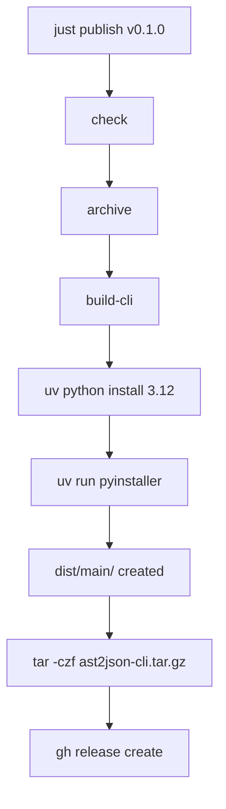

[](https://firstdonoharm.dev/version/3/0/full.html)

** DISCLAIMER : Temporary Readme which is AI-generated, I'll get back to this, I promise **

---

# Build & Release Process

This project uses [`just`](https://github.com/casey/just) as a task runner to automate building the Python CLI into a standalone binary, archiving it, and publishing it to GitHub Releases.

> **Note:** The justfile is configured to use `bash` instead of `sh` by default (`set shell := ["bash", "-cu"]`) to ensure cross-platform compatibility with commands like `source`.

## Prerequisites (Local Development)

To run these commands locally, you must have the following tools installed and in your `$PATH`:
* **[uv](https://docs.astral.sh/uv/)**: Fast Python package manager.
* **[gh](https://cli.github.com/)**: GitHub CLI (used for creating releases).
* **[just](https://github.com/casey/just)**: The command runner itself.

*(Note: If you are running this via GitHub Actions, the workflow automatically installs `uv`, `just`, and `gh`).*

## Available Commands

### `just check`
Validates that all required CLI tools (`uv`, `gh`, `just`) are installed on the system. 
This runs automatically before publishing to fail fast if the environment is missing dependencies.

```bash
just check
```

### `just build-cli`
Compiles `main.py` into a standalone executable using PyInstaller. 
To avoid missing shared library errors on certain Linux systems (like Ubuntu/Debian), it explicitly downloads and uses a standalone Python 3.12 build via `uv python install`. It also uses `--link-mode=copy` to prevent filesystem linking warnings in Docker/CI environments, and explicitly declares its dependencies (`typer`, `ast2json`, `pyinstaller`).

**Output:** Creates a directory at `dist/main/` containing the binary and its dependencies.

```bash
just build-cli
```

### `just archive`
**Dependency:** Runs `build-cli` first.
Takes the compiled output from `dist/main/` and compresses it into a `.tar.gz` archive.

**Output:** Creates `ast2json-cli.tar.gz` in the project root.

```bash
just archive
```

### `just publish <version>`
**Dependencies:** Runs `check`, then `archive`.
Creates a new GitHub Release using the version provided as a positional argument, uploads the `ast2json-cli.tar.gz` archive as a release asset, and generates release notes.

```bash
# Uses the default version (v0.1.0)
just publish

# Pass a specific version tag
just publish v1.2.3
```

### `just clean-cli`
Housekeeping command. Removes all generated files, build caches, and archives to return the repository to a clean state.

```bash
just clean-cli
```

## Execution Flow

When you run `just publish`, the following dependency chain executes automatically:



## CI/CD Integration (GitHub Actions)

Releases are fully automated via GitHub Actions (`.github/workflows/release.yml`).

1. **Trigger:** Pushing a tag to the GitHub remote (e.g., `git push github v0.1.0`).
2. **Setup:** The runner installs `just`, `gh`, and a pinned version of `uv` (v0.11.14).
3. **Execution:** It calls `just publish <tag>`, which builds the binary in an isolated Ubuntu environment and uploads the release artifact.

## Variables

* **`version`** (Default: `"v0.1.0"`): Defines the GitHub Release tag. 
  * **Locally:** Defaults to `v0.1.0` if no argument is passed to `just publish`.
  * **In CI:** Passed explicitly via the workflow using the git tag that triggered the run.

***