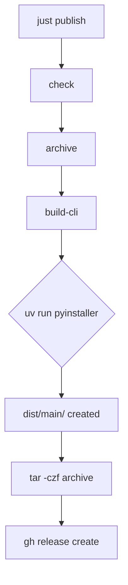

[](https://firstdonoharm.dev/version/3/0/full.html)

** DISCLAIMER : Temporary Readme which is AI-generated, I'll get back to this, I promise **

---

# Build & Release Process

This project uses [`just`](https://github.com/casey/just) as a task runner to automate building the Python CLI into a standalone binary, archiving it, and publishing it to GitHub Releases.

## Prerequisites (Local Development)

To run these commands locally, you must have the following tools installed and in your `$PATH`:
* **[uv](https://docs.astral.sh/uv/)**: Fast Python package manager.
* **[gh](https://cli.github.com/)**: GitHub CLI (used for creating releases).
* **[just](https://github.com/casey/just)**: The command runner itself.

*(Note: If you are running this via GitHub Actions, the workflow automatically installs `uv` and `just`, while `gh` is pre-installed).*

## Available Commands

### `just check`
Validates that all required CLI tools (`uv`, `gh`, `just`) are installed on the system. 
This runs automatically before publishing to fail fast if the environment is missing dependencies.

```bash
just check
```

### `just build-cli`
Compiles `main.py` into a standalone executable using PyInstaller. 
It leverages `uv run --with pyinstaller` to temporarily use PyInstaller without polluting your project's virtual environment.

**Output:** Creates a directory at `dist/main/` containing the binary and its dependencies.

```bash
just build-cli
```

### `just archive`
**Dependency:** Runs `build-cli` first.
Takes the compiled output from `dist/main/` and compresses it into a `.tar.gz` archive, named for the target platform.

**Output:** Creates `your-cli-linux-x86_64.tar.gz` in the project root.

```bash
just archive
```

### `just publish`
**Dependency:** Runs `check`, then `archive`.
Creates a new GitHub Release using the version specified in the `justfile`, uploads the `.tar.gz` archive as a release asset, and automatically generates release notes.

```bash
# Uses the default version (v0.1.0)
just publish

# Overrides the version variable
just publish version=v1.2.3
```

### `just clean-cli`
Housekeeping command. Removes all generated files, build caches, and archives to return the repository to a clean state.

```bash
just clean-cli
```

## Execution Flow

When you run `just publish`, the following dependency chain executes automatically:



## Variables

* **`version`** (Default: `"v0.1.0"`): Defines the GitHub Release tag and archive name. 
  * **Locally:** Defaults to `v0.1.0` unless overridden.
  * **In CI:** Overridden by GitHub Actions using the git tag that triggered the workflow (e.g., `just publish version=${{ github.ref_name }}`).

## CI/CD Integration (Codeberg → GitHub Mirror)

Because this repository is mirrored from Codeberg to GitHub:

1. You push a new git tag to Codeberg (e.g., `git tag v0.1.0 && git push origin v0.1.0`).
2. Codeberg mirrors the tag to GitHub.
3. The GitHub Actions workflow (`.github/workflows/release.yml`) triggers on the new tag.
4. The workflow installs `just` and `uv`, then executes `just publish version=v0.1.0`.
5. The binary is built on the GitHub runner and published directly to your GitHub Releases page.